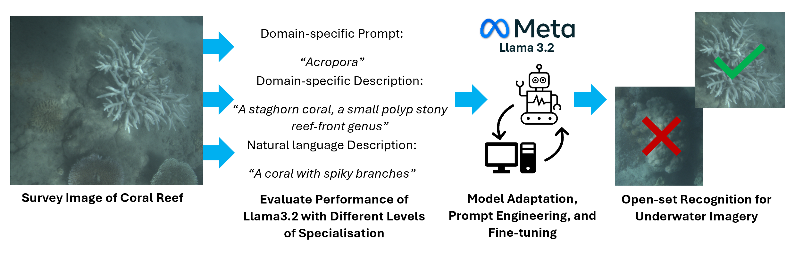
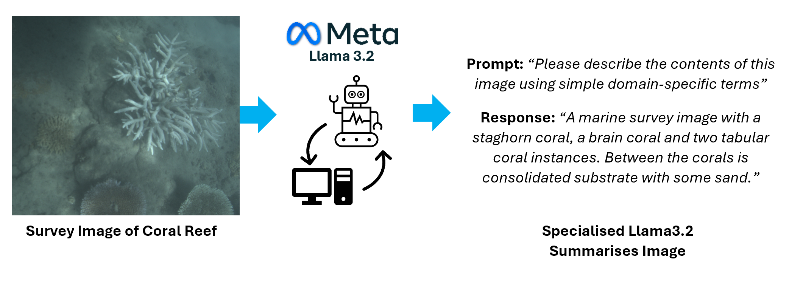

# Meta Llama 3.2

### Leveraging Llama 3.2 for open-set recognition of marine species

**Figure 1:** This project will evaluate and refine Llama 3.2 for domain-specific tasks in underwater monitoring.  

**Figure 2:** By integrating advanced image captioning and object identification with natural language descriptions, Llama 3.2 can facilitate open-set recognition in marine environments. 
